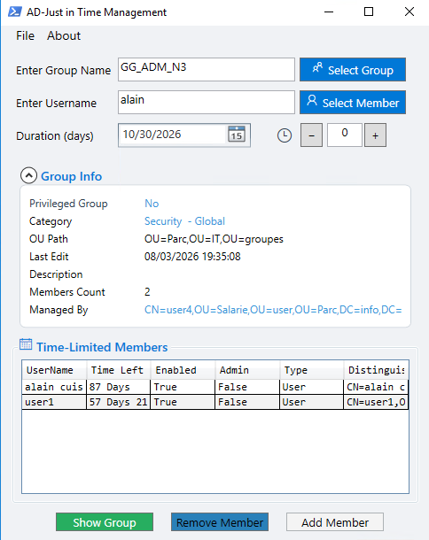
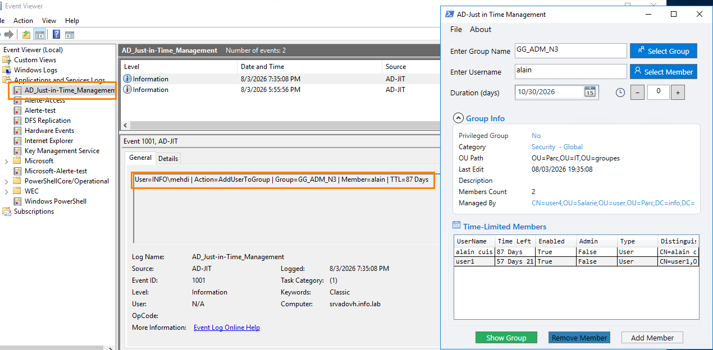

<h1 style="display: flex; justify-content: space-between; align-items: center;">
  
  AD Just-in-Time Management for Tiering Model
</h1>


**AD JIT Management** is a free tool to easily manage identities and privileged access (PAM) in Active Directory using the Just-In-Time (JIT) model through an intuitive interface.  
It lets you temporarily add users to privileged groups, ensuring time-limited and secure access to sensitive resource



## Features

- Simple, intuitive interface, quick to learn, no unnecessary complexity.
- Supports all member types: users, computers, and groups.
- isplays group information along with members currently holding an active TTL.
- Confirmation before action, a confirmation prompt is shown before any add or remove operation.
- Full logging of all actions performed.
- Simple and fast search for users, computers, and groups.

## Requirements

- RSAT Active Directory PowerShell module installed.
- The **Privileged Access Management (PAM) optional feature** must be enabled in the Active Directory.
- The account running the tool must have the appropriate delegation (for example **Write Members** or **Manager can update membership list**) on the target groups.
- Local administrator privileges are required **only once** to create the dedicated Windows Event Log.

## Installation

There is no need for installation. Simply follow these steps:

1. **Obtain the executable file or the PowerShell script**:
   - You can either download the `.exe` file or copy the `ADJIT.ps1` script.

2. **Run the file**:
   - If using the `.exe` file, simply double-click to execute.
   - If using the PowerShell script:
     - Open PowerShell.
     - Execute the script:
       ```powershell
       .\ADJIT.ps1
       ```

## Usage

1. Launch the application (`.exe` or `.ps1`).
2. **The first time only**, open **File → Event Log** and accept the UAC prompt to create the dedicated Windows Event Log. This one-time operation requires local administrator privileges.
3. Ensure the **RSAT Active Directory** tools are installed and that your account has the required Active Directory delegation to manage the target groups.
4. Use the graphical interface to assign temporary (TTL) memberships to Active Directory groups.
5. Monitor the dedicated Windows Event Log to review successful operations, warnings, and errors.

## Why use AD Just-in-Time Management?

- Reduce standing privileged access.
- Implement native Just-in-Time (JIT) administration.
- Support Microsoft's Tiering Model and least privilege recommendations.
- Eliminate manual removal of temporary group memberships.
- Improve auditing and traceability through a dedicated Windows Event Log.
- Simplify Active Directory administration with an intuitive WPF interface.
- Rely entirely on native Microsoft technologies without third-party components.

## Event IDs

AD Just-in-Time Management records operations in the dedicated Windows Event Log using the following event IDs:

| Event ID | Level | Description |
|---|---|---|
| `1001` | Information | A user or group was successfully added to an Active Directory group with a TTL. |
| `1002` | Warning | A temporary member was successfully removed from the Active Directory group. |
| `2001` | Error | An error occurred while adding a user or group to the Active Directory group. |
| `2002` | Error | An error occurred while removing a temporary member from the Active Directory group. |

## Acknowledgements

Special thanks to the following people and communities for their support, expertise, and contributions:

- **Guillaume MATHIEU** – Co-founder of the **Harden** community, for his guidance and valuable advice throughout the project.
 - Alain Cuisenier
 - Andreas Hartig
 - https://www.it-connect.fr/ 
 - [https://www.doctorkloud](https://www.doctorkloud.fr/)
 - https://hardenad.net/




## Contributing

Contributions are welcome! Please fork the repository and create a pull request with your changes.  
Ensure that your code follows the project's coding standards.

## License

This project is licensed under the MIT License - see the [LICENSE](LICENSE) file for details.
